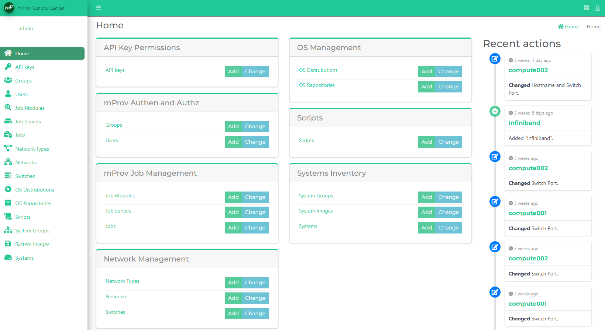

## mProv
mProv is an improvised provisioner.  It was born out of the need for a simple, easy to install, and easy to use way of keeping inventory of
a large number of machines.  mProv was build to be modular, though, so adding new functions to it should be as easy as coding them in python
and plugging them in.  

Visit the [Github Page](https://github.com/mprov-ng/) for more information.  Keep checking back here as well, more updates to come! 

